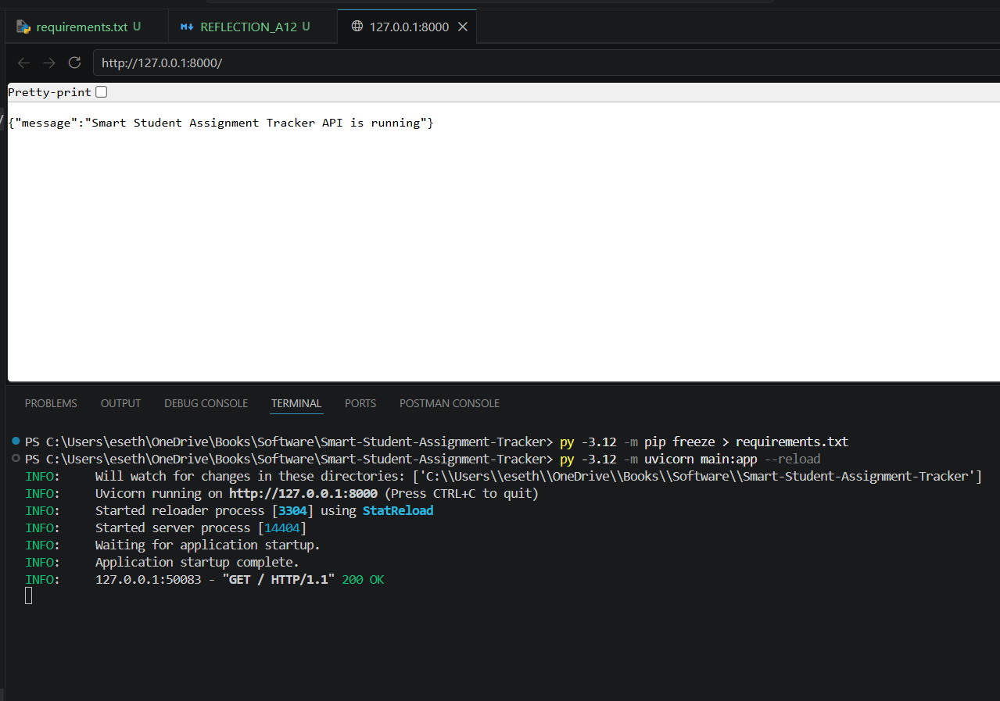

Reflection – Assignment 7

Selecting the appropriate GitHub template was initially challenging because each template is designed for different workflows. The Basic Kanban template was too simple, while the Bug Triage template focused mainly on issue management rather than full development workflows.

The Automated Kanban template was chosen because it provides automation and better aligns with Agile development practices. It reduces manual work by automatically updating task statuses, which is useful for managing tasks efficiently.

Customizing the Kanban board also required careful consideration. Adding columns such as "Testing" and "Blocked" improved workflow visibility but required understanding how tasks move through the development lifecycle.

Compared to tools like Trello and Jira, GitHub Projects is more integrated with development workflows. While Jira provides more advanced features, GitHub Projects is simpler and directly connected to code and issues, making it more suitable for this project.

One challenge was managing all roles alone. In a real Agile team, responsibilities are shared, but in this case, all planning, development, and management tasks had to be handled individually.

Overall, this assignment improved understanding of Agile project management and demonstrated how Kanban boards help organize and track development work effectively.
